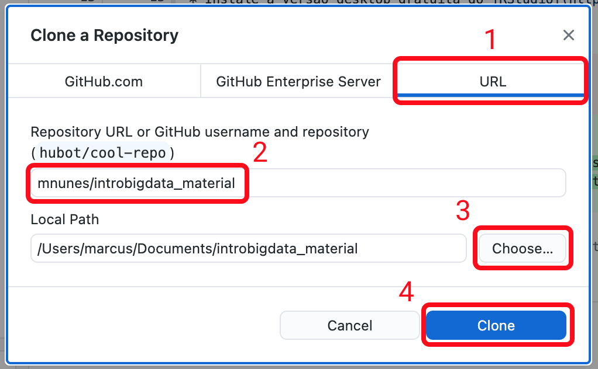

# Introdução

Bem-vindo ao site da disciplina [EST0133 - Introdução à Modelagem de Big Data](https://introbigdata.org/), ministrada aos alunos do [Bacharelado em Estatística da UFRN](https://sigaa.ufrn.br/sigaa/public/departamento/portal.jsf?id=47). O material contido aqui está sendo utilizado durante o semestre 2020.2. Atualmente não é possível aceitar alunos de fora da universidade nesse curso, mas o material está aberto a quem quiser utilizá-lo.

Este é um projeto de [Marcus Nunes](https://marcusnunes.me/).

# Primeiros Passos

Há alguns programas que devem ser instalados em seu computador para que ele fique preparado para acompanhar as aulas. A lista destes programas está abaixo. Eles devem ser instalados na ordem em que estão colocados abaixo.

* Instale o interpretador da linguagem de programação [R](https://www.r-project.org/). A versão 4.0.3 é a mais recente neste momento. Recomendo **fortemente** que, caso o `R` já esteja instalado em seu computador, ele seja atualizado para a versão mais atual.

* Instale a versão desktop gratuita do [RStudio](https://rstudio.com/products/rstudio/download/).

* Há uma série de pacotes a serem instalados no `R` para que a disciplina seja acompanhada. Assim, após abrir o RStudio pela primeira vez, rode o comando abaixo para que todos os pacotes necessários sejam instalados em seu computador. O script irá verificar quais pacotes necessários para a disciplina já estão em seu computador e apenas aqueles pacotes que estiverem faltando serão baixados e instalados. Além disso, o script irá atualizar os pacotes que estiverem em versões antigas. É um comando demorado a ser executado, cuja duração dependerá da sua conexão à internet.

`source("https://raw.githubusercontent.com/mnunes/introbigdata_material/main/scripts/pacotes.R")` 

* É possível baixar os arquivos do curso manualmente. Entretanto, a melhor maneira de se manter atualizado com o que está ocorrendo é através do git. Crie uma conta no [github](https://github.com/) e instale o [GitHub Desktop](https://desktop.github.com/) para facilitar a sua vida. Todas essas ferramentas são gratuitas.

* Com o GitHub Desktop instalado, é necessário **clonar** esse repositório em seu computador. Basta seguir dois passos para isso. O primeiro deles é ir ao menu File > Clone Repository... 

* Em seguida, siga os passos abaixo, na ordem em que estão colocados:
  
  1. Clique no campo URL
  2. Entre com o endereço deste repositório: `mnunes/introbigdata_material`
  3. Escolha uma pasta em seu computador para salvar os arquivos (sugiro que seja na mesma pasta em que estão os materiais de suas outras disciplinas na universidade)
  4. Clique no botão **Clone** para copiar os arquivos para o seu computador

* Sempre que for necessário atualizar o material, clique no botão **Fetch origin**, localizado na barra superior da tela. 

* Se houver uma ou mais atualizações a serem baixadas, clique na mensagem **Pull origin**, que aparecerá no mesmo botão.

* Entre regularmente no Github Desktop para realizar estas duas últimas atividades e, assim, manter-se atualizado com a disciplina. Eventuais _typos_ nos slides e nos códigos serão corrigidos dessa maneira.

* Bugs nos códigos, erros de digitação nos slides, conjuntos de dados faltantes e demais erros ou problemas com o material podem ser facilmente reportados [nesse link](https://github.com/mnunes/introbigdata_material/issues). Usuários avançados do github podem submeter _pull requests_.

# Referências Bibliográficas

O material da disciplina foi produzido a partir de várias referências espalhadas por bibliotecas e pela internet. Poucas delas estão em português.

## Livros

* Hastie, T. e Tibshirani, R. (2009). _The Elements of Statistical Learning: Data Mining, Inference, and Prediction_. Springer. [link](https://web.stanford.edu/~hastie/Papers/ESLII.pdf)
* Izbicki, R. e Santos, Thiago Mendonça dos. (2020) _Aprendizado de máquina: uma abordagem estatística_. São Carlos. [link](http://www.rizbicki.ufscar.br/AME.pdf)
* James, G., Witten, D., Hastie, T., e Tibshirani, R. (2014). _An Introduction to Statistical Learning with Applications in R_. Springer.
* Kuhn, M. e Johnson, K. (2013). _Applied Predictive Modeling_. Springer.
* Lantz, B. (2013). _Machine Learning with R_. Packt Publishing.
* Tan, P.-K., Steinbach, M., e Kumar, V. (2012). _Introdução ao Data Mining: Mineração de Dados_. Ciência Moderna.
* Zhao, Y. (2012). _R and Data Mining: Examples and Case Studies_. Academic Press.

## Sites

* [Tidyverse](https://www.tidyverse.org/)
* [Tidymodels](https://www.tidymodels.org/)
* [DS-Zero](https://github.com/leobezerra/ds-zero)

# Leituras complementares

* Domingos, P. (2015). _The Master Algorithm: How the Quest for the Ultimate Learning Machine Will Remake Our World_. Basic Books.
* O'Neil, C. (2017) _Weapons of Math Destruction: How Big Data Increases Inequality and Threatens Democracy_. Crown.
* O'Neil, C. e Schutt, R. (2013) _Doing Data Science: Straight Talk from the Frontline_. O'Reilly.
* Parker, M. (2020). _Humble Pi: A Comedy of Maths Errors_. Penguin.

